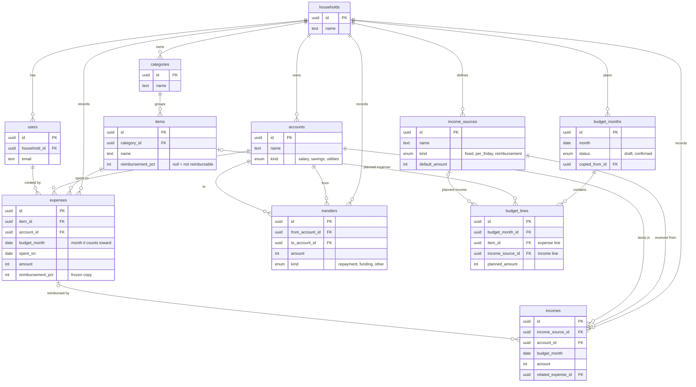

# Entity Relationship Diagram

Companion to `data-model.md`. Renders in GitHub and in VS Code with a Mermaid preview extension.

```mermaid
erDiagram
    households ||--o{ users : has
    households ||--o{ accounts : owns
    households ||--o{ categories : owns
    households ||--o{ budget_months : plans
    households ||--o{ income_sources : defines
    households ||--o{ expenses : records
    households ||--o{ incomes : records
    households ||--o{ transfers : records

    categories ||--o{ items : groups

    budget_months ||--o{ budget_lines : contains
    items |o--o{ budget_lines : "planned expense"
    income_sources |o--o{ budget_lines : "planned income"

    items ||--o{ expenses : "spent on"
    accounts ||--o{ expenses : "paid from"
    users ||--o{ expenses : "created by"

    income_sources ||--o{ incomes : "received from"
    accounts ||--o{ incomes : "lands in"
    expenses |o--o{ incomes : "reimbursed by"

    accounts ||--o{ transfers : "from"
    accounts ||--o{ transfers : "to"

    households {
        uuid id PK
        text name
    }
    users {
        uuid id PK
        uuid household_id FK
        text email
    }
    accounts {
        uuid id PK
        text name
        enum kind "salary, savings, utilities"
    }
    categories {
        uuid id PK
        text name
    }
    items {
        uuid id PK
        uuid category_id FK
        text name
        int reimbursement_pct "null = not reimbursable"
    }
    budget_months {
        uuid id PK
        date month
        enum status "draft, confirmed"
        uuid copied_from_id FK
    }
    budget_lines {
        uuid id PK
        uuid budget_month_id FK
        uuid item_id FK "expense line"
        uuid income_source_id FK "income line"
        int planned_amount
    }
    income_sources {
        uuid id PK
        text name
        enum kind "fixed, per_friday, reimbursement"
        int default_amount
    }
    expenses {
        uuid id PK
        uuid item_id FK
        uuid account_id FK
        date budget_month "month it counts toward"
        date spent_on
        int amount
        int reimbursement_pct "frozen copy"
    }
    incomes {
        uuid id PK
        uuid income_source_id FK
        uuid account_id FK
        date budget_month
        int amount
        uuid related_expense_id FK
    }
    transfers {
        uuid id PK
        uuid from_account_id FK
        uuid to_account_id FK
        int amount
        enum kind "repayment, funding, other"
    }
```
